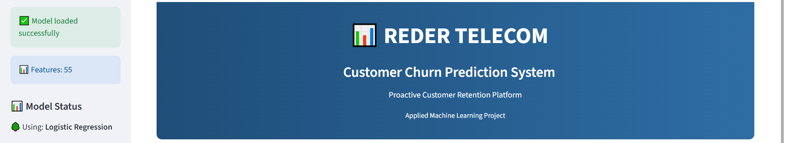
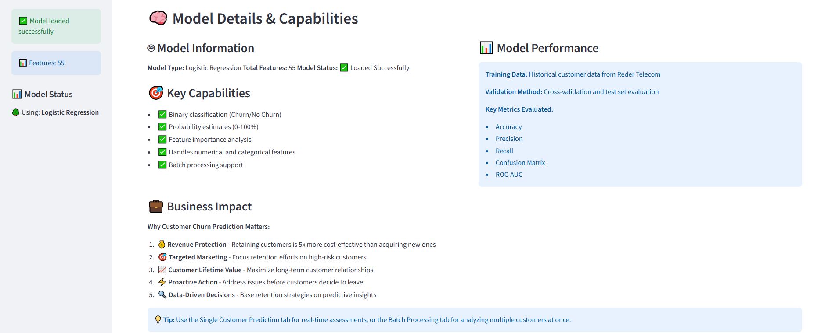

# 📊 Reder Telecom Churn Prediction System

> **Machine Learning Customer Retention Platform**  
---

## 🚀 Overview

Reder Telecom faces a critical challenge - **predicting and preventing customer churn**.  
This project provides an end‑to‑end **machine learning and data‑driven solution** that helps identify customers most likely to leave, empowering targeted retention strategies.

**Deliverables:**
- 🎯 Real‑time churn prediction for single customers  
- 📈 Batch churn scoring for entire customer lists  
- 🧠 Feature‑level interpretation for business insights  

---

---

---

## 🧩 Key Features

✅ Logistic Regression classifier built with Scikit‑learn  
✅ Intuitive Streamlit dashboard for predictions  
✅ Clean feature‑engineering pipeline on customer behavior data  
✅ Batch upload and CSV download support  
✅ Model explainability via coefficient contributions  

---

**Francis Afful Gyan**    
📧 Email: francisaffulgyan@gmail.com 

🔗 LinkedIn: [https://www.linkedin.com/in/francis-afful-gyan-2b27a5153/]  
📅 Date: October 2025

---

**🌐 Live Demo**: [https://newprojectchurn.streamlit.app/](https://newprojectchurn.streamlit.app/)

**📊 Project Status**: Active Development

**⭐ If you find this project useful, please consider giving it a star!**
## Thank You

